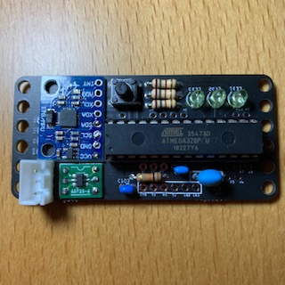
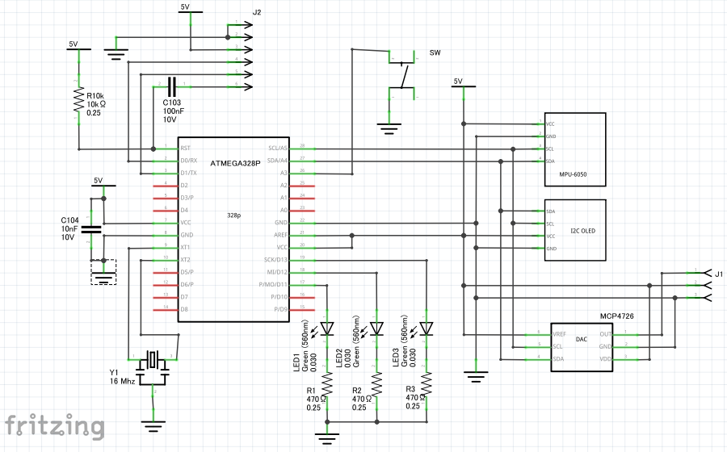
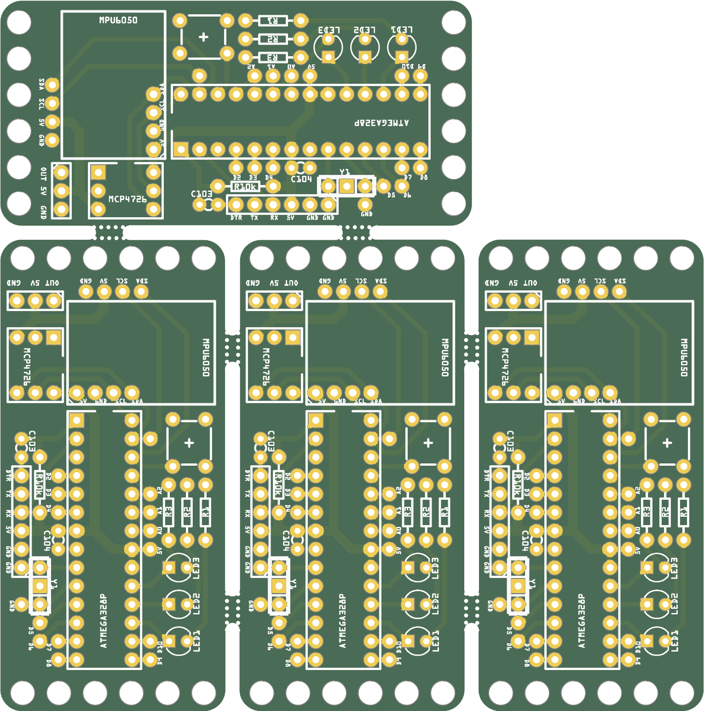
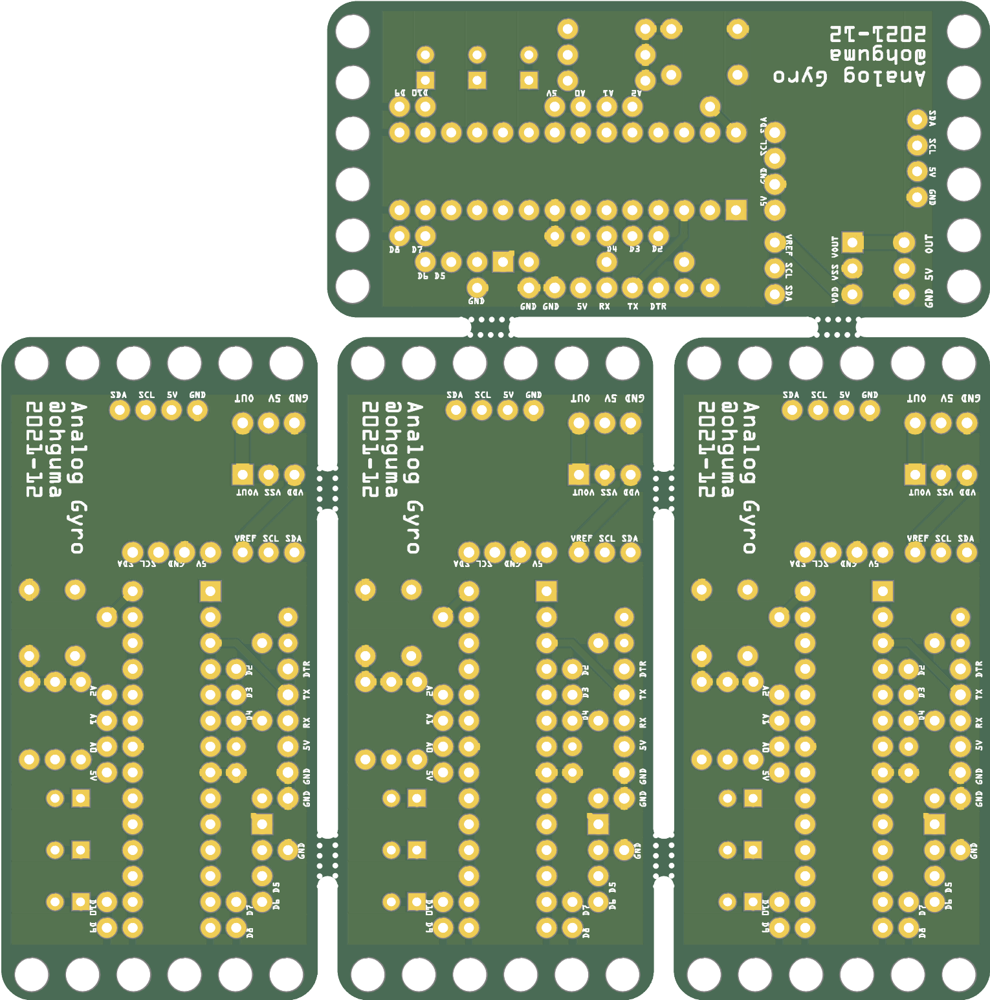

# アナログ出力ジャイロセンサ

+ 電源が5Vのマイコンキットなどのアナログ入力で利用するためのジャイロセンサ。
+ Arduino 互換機として作成。

## スケッチについて

+ こちらで紹介されている「センサーから値を取得するプログラム」と「センサーのキャリブレーションについて」のスケッチ（※1）をまとめて、スイッチの長押しロジックとDAC出力機能を追加して作成。
  + [センサーの使い方(ジャイロ編) : Revolution_Include](http://blog.livedoor.jp/revolution_include/archives/2815979.html)
+ 事前にgithubの「jrowberg/i2cdevlib」をダウンロードしておく。
  + https://github.com/jrowberg/i2cdevlib
  + 「code」ボタンの「Download ZIP」からダウンロードする。
  + 「i2cdevlib-master.zip」を展開し、「Arduino」フォルダ内にある「I2Cdev」「MPU6050」の2フォルダを「Arduino IDE」のライブラリフォルダ内にコピーする。
  + Arduino IDEを再起動し、メニューの「スケッチ」→「ライブラリのインクルード」に「I2Cdev」「MPU6050」があることを確認する。
+ ※1の2つのスケッチではどちらもMPU6050というデータ型が利用されているが、 「MPU6050_6Axis_MotionApps20.h」と「MPU6050.h」をそのまま同時にインクルードするとデータ型「MPU6050」の2重定義でコンパイルがエラーになるので、「#define I2CDEVLIB_MPU6050_TYPEDEF」を事前に記述して「MPU6050.h」でのデータ型「MPU6050」の定義を回避しつつ、自作スケッチではデータ型「MPU6050」でなく、それぞれのヘッダーファイルで定義されている元の形「MPU6050_6Axis_MotionApps20」「MPU6050_Base」を利用した。
+ 起動時の方向を基準として動作する。基準向きの場合に2.5Vを出力し、それより右に向くと電圧が下がり（最小0V）、左に向くと電圧が上がる（最大5V）。基準向きの反対方向で0Vと5Vが入れ替わる。
+ 基準向きから+-1度の範囲内で中央のLEDが点灯する。基準向きから+-5度の範囲内で左右のLEDが点灯する。それ以外の向きはLEDは消灯する。
+ タクトスイッチを短押しした時の方向を基準方向としてリセットする。3秒以上長押しするとキャリブレーションを開始する。キャリブレーション時はセンサーは静止した状態にしておき、LEDが3つとも点灯したらスイッチを離し、キャリブレーションの終了を待つ（数十秒）。 
+ キャリブレーション時に取得したジャイロセンサのオフセット値はEEPROMに保存する。起動時にはEEPROMからオフセット値を読み込んで動作するため、最初にスケッチをアップロードした際にはすぐにキャリブレーションする。

## パーツリスト
個数は明記なければ1個。
+ [Ａｒｄｕｉｎｏ　Ｂｏｏｔｌｏａｄｅｒ書込済（５Ｖ　１６ＭＨｚ仕様）　ＡＴｍｅｇａ３２８Ｐ](https://akizukidenshi.com/catalog/g/gI-12774/)
  + 自前でブートローダーが書き込めるなら「 [ＡＶＲマイコン　ＡＴＭＥＧＡ３２８Ｐ－ＰＵ](https://akizukidenshi.com/catalog/g/gI-03142/)」もあり。
+ MPU6050
  + amazon などでMPU6050(GY-521)として売られているもの。数百円。 
+ [ＭＣＰ４７２６搭載１２ビットＤ／Ａ変換モジュール](https://akizukidenshi.com/catalog/g/gK-07995/)
  + 本センサは水平に設置する前提でヨー軸角度をアナログ出力するのでそのためのDAC。
+ [セラミック発振子（セラロック）コンデンサー内蔵タイプ　１６ＭＨｚ](https://akizukidenshi.com/catalog/g/gP-09576/)
+ 28ピン　ICソケット
+ タクトスイッチ
+ 3mmLED 3個
+ LED用抵抗 3個
+ C 0.01μF(10nF) 103　328Pのリセット回路用。
+ C 0.1μF(100nF) 104  328P用パスコン
+ 配線用のコネクタなど

## 基板・回路図

+ OLEDはコストカットのため未実装。なお、I2C接続で画素数128x32のものを直接基板に取り付けできる予定だったが、MPU6050の基板が邪魔になっている。
+ [Fritzing](https://fritzing.org/)で設計し、基板作成まで行った。
+ 基板作成の面付けについては 「[Fritzing入門実習テキスト「Fritzing Basics」#マッハ新書 （ダウンロード商品）](https://booth.pm/ja/items/1414214)」の手順に従った。
  + 
  + 
+ 基板作成は「[JLCPCB](https://jlcpcb.com/)」。つや消し黒が安い。発注から1週間ほどで到着（運送便はUPS、支払いはpaypal）。
  + twitter https://twitter.com/JLCPCB_Japan
+ [発注時ガーバーファイル](./pcb/combined.zip)
+ [GerberPanelizer.exeデータ](./pcb/gyro_328p_6050_2021_panelize.gerberset)
+ [Frizingのプリント基板外形SVG](./pcb/gyro_328p_6050_2021.svg)

----
2021-12-29 ohguma